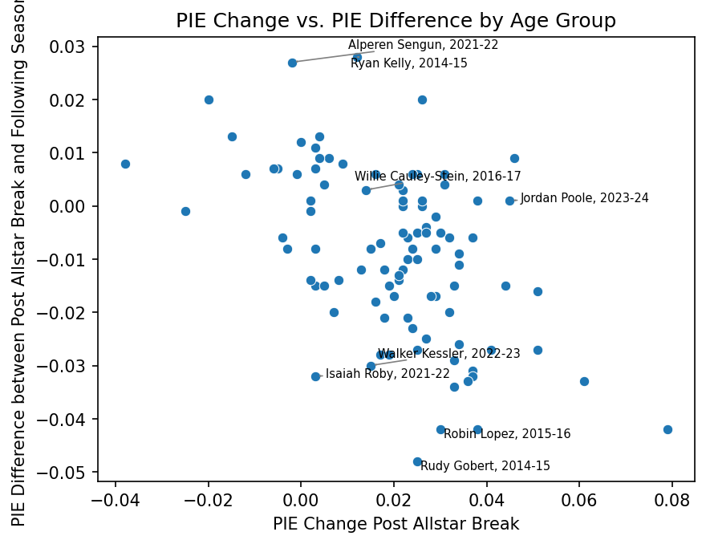

# Is it just a Mirage: Identify Legit Breakout Candidates and Imposters in the Age of Tanking in the NBA
## Author: Mike Zhang ##

## Project Overview & Question
Everybody who follows the NBA even remotely knows that the league has had a tanking problem, and despite the league's attempts to implement anti-tanking measures, such as the bottom-three teams sharing the same lottery odds, tanking is only becoming more egregious year by year. However, this does provide those bad teams that have already lost playoff hope long before the season even started an opportunity to test their young cores, from which might emerge the next stars, and this raises a natural question: are post-All-Star breakouts on tanking teams real, or just noise? To answer that question, I operationalized player performance on PIE, a boxscore-based advanced metric, to see whether players in tanking teams sustained their post-All-Star performance in the following season, using data from the past 10 seasons.

## Key Findings
* Breakout players who "leaped" after all-star breaks on tanking teams tend to regress the following season
* The higher these players leaped, the harder they would land
* Young breakout players tend to sustain their improvement better than older players
* Position did not significantly predict regression magnitude, though centers tended to post higher absolute PIE levels the following season than guards or forwards

## Data
Breakout seasons span 2014-15 to 2023-24, with following-season outcomes drawn through 2024-25. The 2019-20 season is excluded due to COVID-19. All data are obtained from the official `nba_api` endpoints. To capture the "big leap in a tanking team post all-star break" scenario as accurately as possible, multiple inclusion criteria are implemented. To qualify, a player must:
* Be no older than 28
* Be on a tanking team (bottom 12 by pre-All-Star win rate)
* be at least a rotation-level player before all-star breaks
* Demonstrated breakout after all-star breaks (PIE increase or significant minutes jump)
* No established stars (prior season PIE cap at 0.11)
* Sufficient following season sample (GP >= 30)
Ultimately, the inclusion criteria left me with exactly 100 players for my analysis.

## Methodology
Multiple linear regression and logistic regression are utilized, with players' age after all-star breaks, change in PIE pre- and post- all-star breaks, and players' position as predictors. Linear regression is run on both the primary outcome, the difference between post-all-star break PIE and the following season's PIE, and the secondary outcome, absolute PIE in the following season. More predictors were included in the model originally, but severe multicollinearity was present among certain variables whose VIFs exceeded 5. These variables were eventually dropped. For the logistic regression, the difference between post-all-star break PIE and the following season's PIE is transformed into a binary outcome to indicate whether a player sustains their post-all-star surge or not. 
